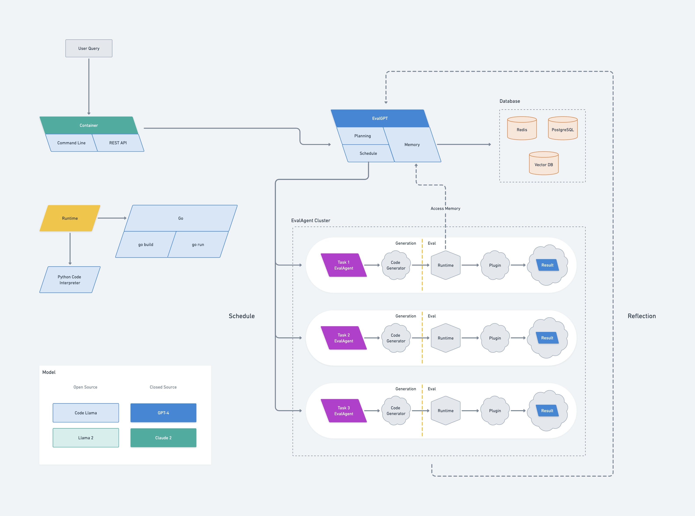

<div align="center">

# Eval GPT

</div>

## What is Eval GPT

Eval GPT is a software that empowers Large Language Models (LLMs), such as GPT4, with tool usage capabilities. It
interacts with LLMs to obtain problem-solving steps, then selects the appropriate tool agent to resolve the issue.

## Benefits

- Command Line Tool
- Restful API [TODO]
- Access internet with python requests lib
- Interact with files
- Extensibility with Plugins [TODO]

## Architecture



## Quick Start 🚀

### Install `evalgpt`

You can install evalgpt using the following command:

```bash
go install github.com/index-labs/evalgpt@latest
```

You could verify the installation by running the following command:

```bash
evalgpt -h
```

### Build it from source code

```bash
git clone https://github.com/index-labs/evalgpt.git

cd evalgpt

go mod tidy && go mod vendor

mkdir -p ./bin

go build -o ./bin/evalgpt ./*.go

./bin/evalgpt -h
```

Then you can find it on bin directory.

### Configuration

After you install evalgpt command line, before execute it, you must config below options:

**Configure Openai API Key**

```bash
export OPENAI_API_KEY=sk_******
```

also, you can config openai api key by command args, but it's not recommend:

```bash
evalgpt --openai-api-key sk_***** -q <query>

```

**Configure Python Interpreter**

By default, the code interpreter uses the system's Python interpreter. However, you can create a completely new Python
interpreter using Python's virtual environment tools and configure it accordingly.

```bash
python3 -m venv /path/evalgpt/venv
# install third python libraries
/path/evalgpt/venv/bin/pip3 install -r requirements.txt

# config python interpreter
export PYTHON_INTERPRETER=/path/evalgpt/venv/bin/python3
```

or

```bash
evalgpt --python-interpreter /path/evalgpt/venv/bin/python3 -q <query>
```

**Note:**

Before tackling complex tasks, ensure to install necessary Python third-party libraries. This equips your code
interpreter to handle corresponding tasks, boosting efficiency and ensuring smooth operation.

### Usage

**Help**

```bash
> evalgpt -h
NAME:
   evalgpt help - A new cli application

USAGE:
   evalgpt help [global options] command [command options] [arguments...]

DESCRIPTION:
   description

COMMANDS:
   help, h  Shows a list of commands or help for one command

GLOBAL OPTIONS:
   --openai-api-key value         Openai Api Key, if you use open ai model gpt3 or gpt4, you must set this flag [$OPENAI_API_KEY]
   --model value                  LLM name (default: "gpt-4-0613") [$MODEL]
   --python-interpreter value     python interpreter path (default: "/usr/bin/python3") [$PYTHON_INTERPRETER]
   --verbose, -v                  print verbose log (default: false) [$VERBOSE]
   --query value, -q value        what you want to ask
   --file value [ --file value ]  the path to the file to be parsed and processed, eg. --file /tmp/a.txt --file /tmp/b.txt
   --help, -h                     show help
```

**Note:**

Remember to configure the OpenAI API key and Python interpreter before executing the code interpreter, The following
examples have already been configured with environment variables for the OpenAI API key and the Python interpreter.

**Simple Query**

Get the public IP address of the machine:

```bash
❯ evalgpt -q 'get the public IP of my computer'
Your public IP is: 104.28.240.133
```

Calculate the sha256 hash of a string:

```bash
❯ evalgpt -q 'calculate the sha256 of the "hello,world"'
77df263f49123356d28a4a8715d25bf5b980beeeb503cab46ea61ac9f3320eda
```

Get the title of a website:

```bash
❯ evalgpt -q "get the title of a website: https://arxiv.org/abs/2302.04761" -v
[2302.04761] Toolformer: Language Models Can Teach Themselves to Use Tools
```

**Pipeline**

You can user pipeline to input context data and query on it:

```bash
> cat a.csv
date,dau
2023-08-20,1000
2023-08-21,900
2023-08-22,1100
2023-08-23,2000
2023-08-24,1800

> cat a.csv | evalgpt -q 'calculate the average dau'
Average DAU:  1360.0
```

**Interact with files**

convert png file to webp file:

```bash
> ls
a.png

> evalgpt -q 'convert this png file to webp' --file ./a.png
created file: a.webp

> ls
a.png a.webp
```

Draw a line graph based on the data from the CSV

```bash
> cat a.csv
date,dau
2023-08-20,1000
2023-08-21,900
2023-08-22,1100
2023-08-23,2000
2023-08-24,1800

> evalgpt -q 'draw a line graph based on the data from the CSV' --file ./a.csv
```

output:


